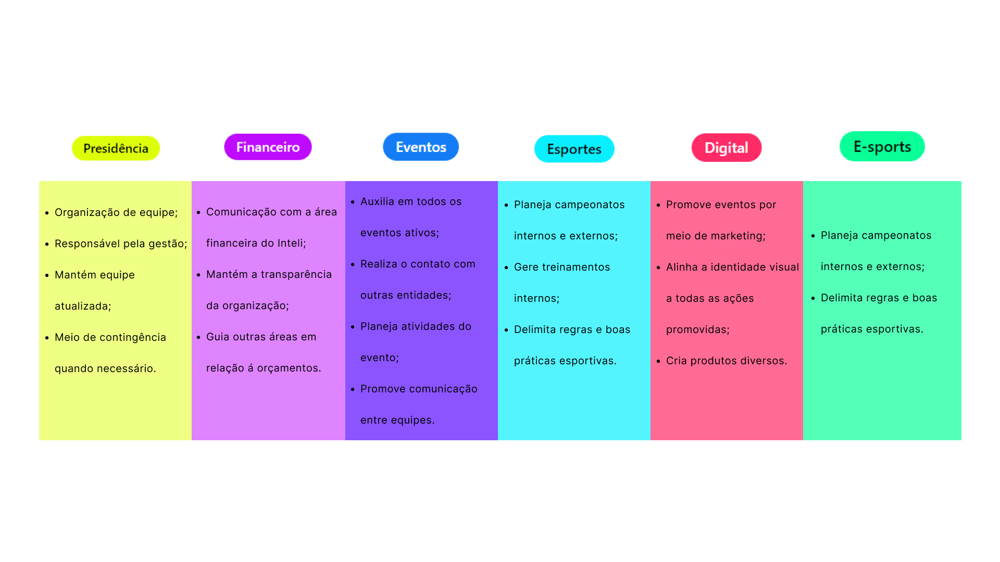
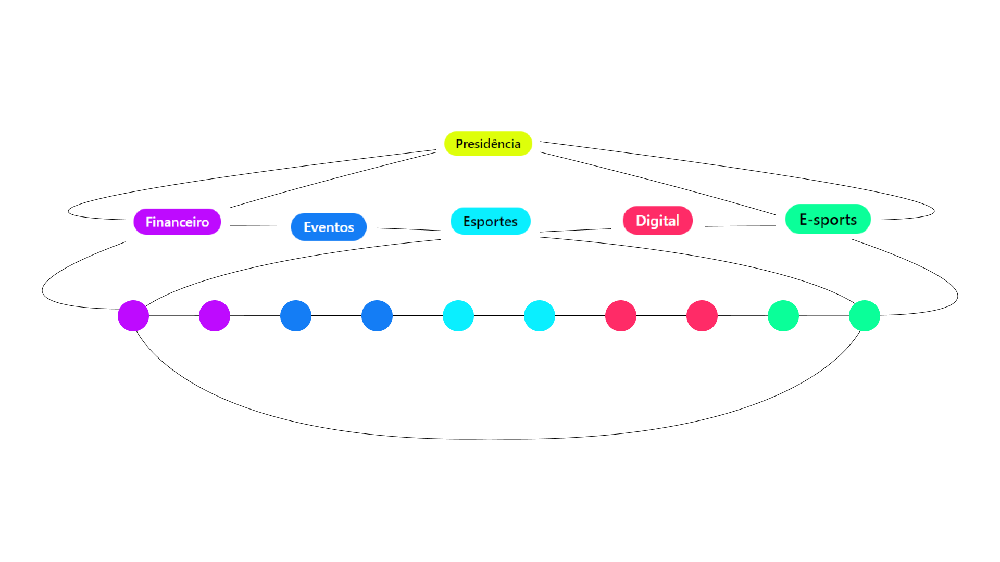

# 🕷️ Gestão 2024 - Equipe Tantera 

## 🕸️ Olá! Aqui é a Equipe Tantera! 🕸️

  

> Eae? Tudo certo? Neste repo existem todas as ferramentas que a Tantera precisou para se organizar e construir os projetos de 2024! No decorrer desse arquivo vamos te explicar como usar esse ferramenta linda (Github) para realizar uma belíssima gestão 👌

## Objetivos 
- Organização de projetos da Atlética Tantera;
- Documentação sobre eventos já concluidos ou em andamento;
- Controle de entregas;
- Gestão de equipe (boa de verdade, sem querer bater no coleguinha de outra diretoria).

  

## Centro de organização

Quem é a Equipe Tantera? Como funciona a gestão de projetos por aqui?

### Diretorias

Nossas 6 áreas se complementam da seguinte maneira:

  Figura 1: Áreas - Atlética TAntera
  
  Fonte: Os autores (2024)

Sabemos que deve parecer estranho a presidência entrar no mesmo nível de organização que outras diretorias, mas isso acontece por que presamos por uma Governança Horizontal, onde todas as áreas tem a mesma importância e se ajudam entre si. 

  Figura 1: Áreas - Atlética TAntera
  
  Fonte: Os autores (2024)

(Mais sobre a equipe 24' na planilha de cargos)

### Repositório
Este repo permite que toda a mágica aconteça, nele estão guardadas as informações essenciais sobre cada diretoria e evento realizado.

### Projetos
Os projetos fazem referência a este repositório, é por meio deles que sabemos datas, direcionamentos, áreas e urgências de cada tipo de entrega.

### *Issues*
As *issues* representam as entregas de cada divisão de projeto, são definidas em conjunto entre as diretorias e a presidência.

### *Labels*
As etiquetas fazem parte da organização geral e pmitem saber qual área está responsável por qual parte do projeto.

### Milestone
Essas são as famosas "sprints", mas diferente de um projeto no inteli, elas são flexíveis e variam de projeto para projeto.

> Importante ressaltar que temos reuniões gerais a cada duas semanas (quase uma planning).

Faz inteligente e vem pra Tantera! 

  

**Se increvam no processo seletivo e façam parte do legado!**

Equipe Tantera 24'.

